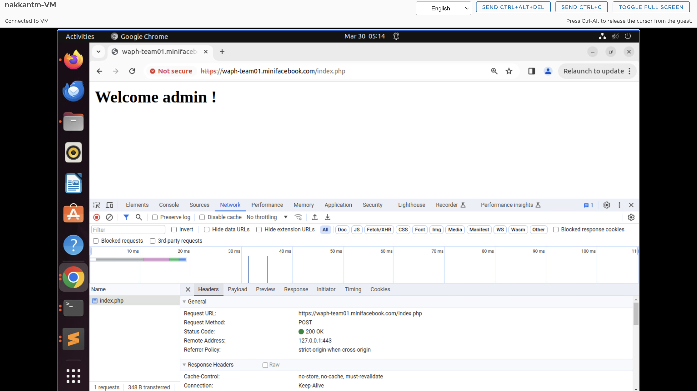
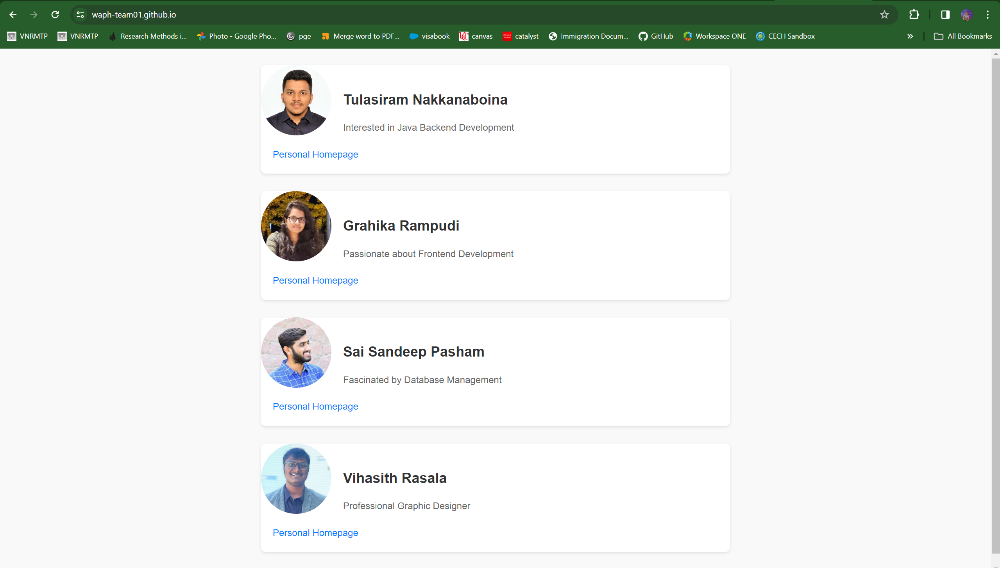
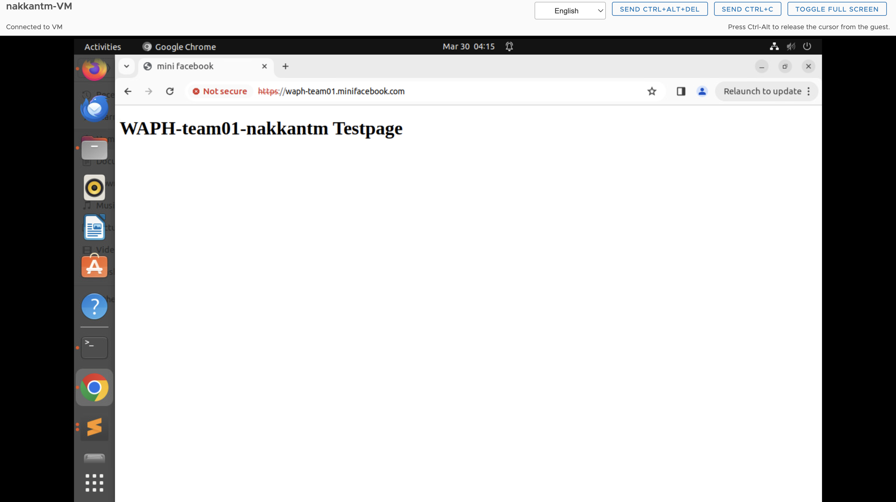
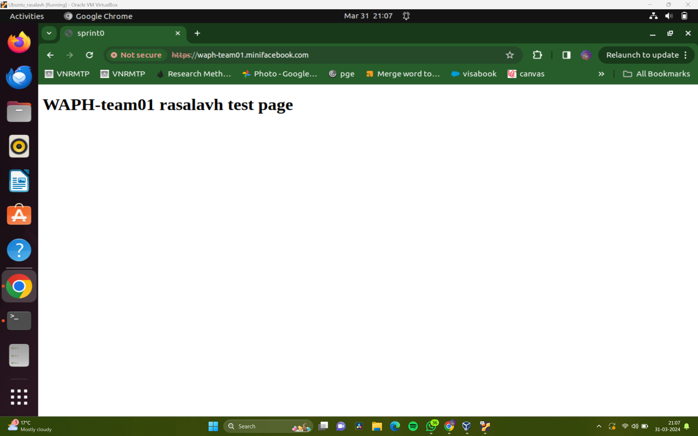
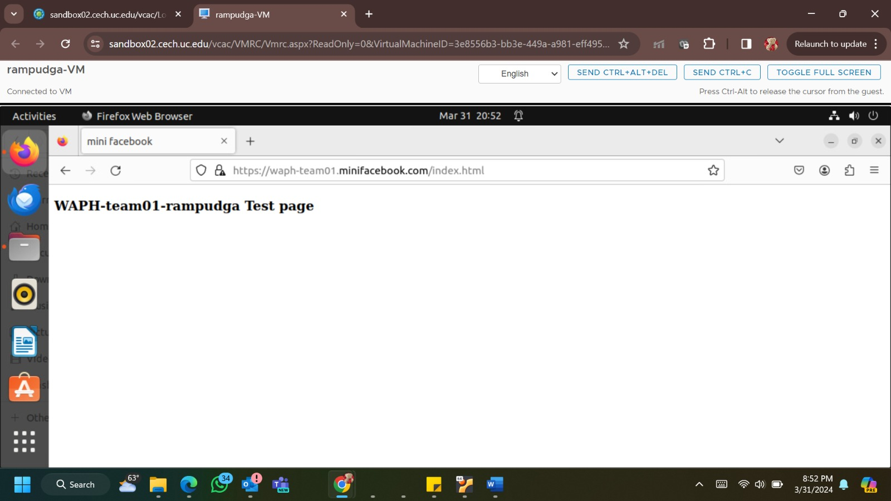
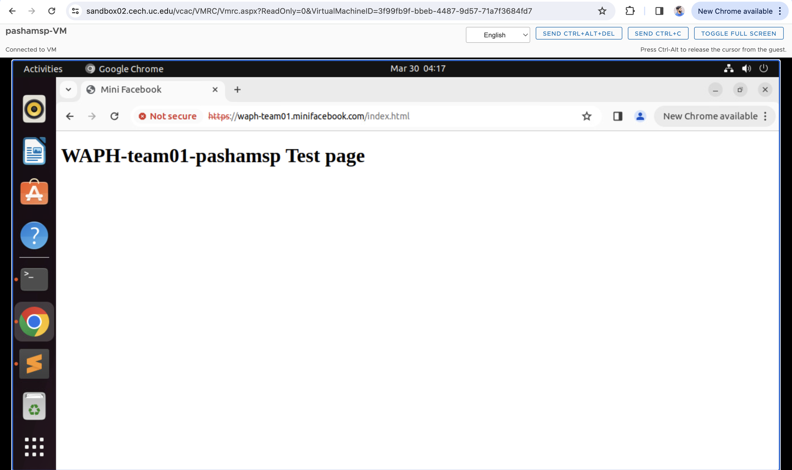

# WAPH-Web Application Programming and Hacking

## Instructor: Dr. Phu Phung

# Project Title: MiniFacebook

# Team members

1. Tulasiram Nakkanaboina,   nakkantm@mail.uc.edu
2. Vihasith Rasala,          rasalavh@mail.uc.edu
3. Grahika Rampudi,          Rampudga@mail.uc.edu
4. Sai Sandeep Pasham,       pashamsp@mail.uc.edu

# Project Management Information

Source code repository (private access): [Click_here](https://github.com/waph-team01/waph-teamproject)

Project homepage (public): [Click_here](https://github.com/waph-team01/waph-team01.github.io)

#**Team members headshot**
   

## Revision History

| Date       |   Version     |  Description |
|------------|:-------------:|-------------:|
| 26/03/2024 |  0.0          | Init draft   |
| 31/03/2024 |  0.1          | Drafting template   |

# Overview
The mian task of the WAPH procject deals about an inclusive development of a web application called "MiniFacebook". The process od development of the web applications includes a schematic usage of full stack web development learnings and cybersecurity principles which is used for securing the web application by not making it vulnerable for hackers. The website is being developed by our team which constitutes of four members of same class. We used Whatsapp as a channel to communicate and most of our discussion made in physical sessions. We used collobartive notes which can be accessed by all of our teammates where we use that one for the porject discussions, ideas and thoughts for the progress of the project. 

# System Analysis

For the initial phase of the project we developed the website using the system config file which is being used and edited for the WAPH-team project file. Hosts file in etc folder is udpated with the public url waph-team01.minifacebook.com adjacent to the I.P Address. After the creation of the website the web application is being accessed by our team members and the  demo screenshots are provided below. 

# Snippets of the test pages (Demo)

## High-level Requirements

List high-level requirements of the project that your team will develop into use cases in later steps

# System Design

_(Start from Sprint 1, keep updating)_

## Use-Case Realization

## Database 

## User Interface

# Implementation

_(Start from Sprint 1, keep updating. However, it is important to prepare the technology from Sprint 0)_

For each new sprint cycle, update the implementation of your system (break it down into subsections). Please include some code snippets to illustrate the implementation.

Specify your team's development approach, including programming languages, databases, development, testing, and deployment environments. 

# Security analysis

_Include a brief explanation of your implementation and the security aspects based on the following questions:_

*  How did you apply the security programming principles in your project?
*  What database security principles have you used in your project?
*  Is your code robust and defensive? How?
*  How did you defend your code against known attacks such as XSS, SQL Injection, CSRF, Session Hijacking
*   How do you separate the roles of super users and regular users?

# Software Process Management

_(starting from sprint 0, and updates)_

## Scrum process
to be written
### Sprint 0

Duration: 22/03/2024-03/31/2024

#### Completed Tasks: 

1. Our team has successfully established both public and private repositories named "waph-teamproject" and "waph-team01.github.io" correspondingly.
2. SSL certificates and keys for the team project have been generated.
3. HTTPS has been configured within the local domain name to ensure secure communication.
4. A database has been set up for the system.
5. Individual home pages have been developed for all team members, and their respective lab files have been transferred to the team directory.
6. Testing of the index.html page has been carried out, yielding the anticipated performance and functionality as observed during the tests.

#### Contributions: 

1. Tulasiram Nakkanaboina, 11 commits, 7 hours, contributed in generating the SSL keys and certificates. 
2. Vihasith Rasala, 8 commits, 6 hours, contributed in documentation of README file and organizing the data.
3. Grahika Rampudi, 8 commits, 7 hours, contributed in creating the personal page of our team which includes details of our team members.
4. Sai Sandeep Pasham, 6 commits, 9 hours, contributed in creating the index.html page which includes the details of admin login. 

# Appendix

upload code screenshots
